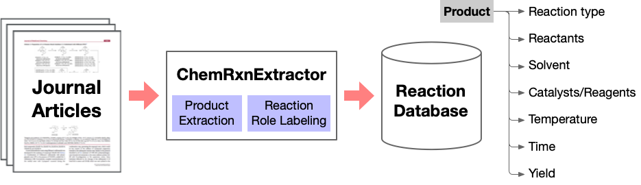

# Chemical Reaction Extraction from Scientific Literature

This repository contains code/data for the JCIM paper: [Automated Chemical Reaction Extraction from Scientific Literature](https://pubs.acs.org/doi/pdf/10.1021/acs.jcim.1c00284).

</img>

## Installation

### Pre-requirements
1. python>=3.6
2. pytorch==1.8.0
3. transformers==4.18.0
4. tqdm (>=4.36.0)
5. numpy (>=1.18.0)
6. seqeval

### Trained Models
train model已经放在了chem-pretrain文件夹里, 包括prod和role两种任务的预训练模型, 预训练模型的路径需要放在model_name_or_path里面

### Usage
1、数据处理
所有数据处理的代码在./chemrxnextractor/data下，prod.py和role.py
数据处理见prod.py或者role.py下的convert_examples_to_features函数，结果生成的包括input_ids,attention_mask,token_type_ids,label_ids,decoder_mask
其中input_ids,attention_mask,token_type_ids是模型的输入，input_ids是输入进行tokenize之后的token的id，attention_mask为输入需要mask的id(根据输入长度计算),
token_type_ids表示输入的sentence id,这里输入只有一个句子因此token_type都是1, decoder_mask主要运用于解码端，也就是在预测时需要跟原始输入的位置一一匹配, 
这是因为bert的tokenizer会把原始的word拆分，导致长度以及位置发生变化，decoder_mask会记录input_ids的位置映射到原始输入位置。
label_ids分为两种，对于crf跟softmax而言，label是一个跟input_ids序列一样长的列表，每个位置记录对应token id真实的标签id,
对于global pointer其label_ids是一个矩阵，其shape=(sequence_len, sequence_len)，label_ids[i, j]表示token从i到j组成的短语对应的标签，如果是实体则为1，反之亦然

2、模型调用
所有的模型框架都在./chemrxnextractor/models下，主函数入口在model.py文件里面，需要调用的crf层以及globalpointer层分别封装在crf_bak.py和GlobalPointer.py里面
所有的模型都包括forword跟decode两个主函数，前者主要是进行前向计算，后者是在预测时对logit进行解码返回原始输入对应的label

模型的选择主要在训练参数文件，参数文件在./configs/prod_train.json or ./configs/role_train.json, 若采用crf则use_crf=true, use_gp=false
若采用global pointer则use_crf=false, use_gp=true

3、模型的训练与预测
运行整个项目代码python train.py "prod" ./config/prod_train.json or python train.py "role" ./config/role_train.json 
其中需要训练的话do_train=true, do_eval=true
需要预测的话do_prediction=true, 注意的是如果不用训练，将do_train=false, do_eval=false时代码会去model_name_or_path下的best文件夹里面加载模型，如果没有会报错

4、参数设置
除上面已经提到的参数，剩下可以修改的模型训练参数主要是num_train_epochs、per_device_train_batch_size和per_device_eval_batch_size
输入数据跟输出模型的位置参数 data_dir，output_dir
输入文件对应的标签文件参数 labels
剩下的参数建议保持不变即可

5、模型效果
模型效果建议先提前保存一下，可以放在你的report里面
你自己跑的时候别覆盖了不然需要重新跑比较耗时
我已经把prod跟role两个数据集下的crf跟global pointer模型的效果都跑出来了，具体见./models/xx_xx/test_results.txt，里面包含测试集的presicion、recall和f1
训练日志也保存在./xx_xx_xx.log里面，模型的日志保存在./models/xx_xx/run/xxx里面，这里面的日志可以通过安装tensorborad来查看，可以看loss之类的(如果你需要的话)
